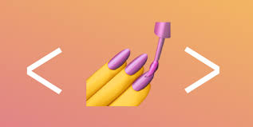
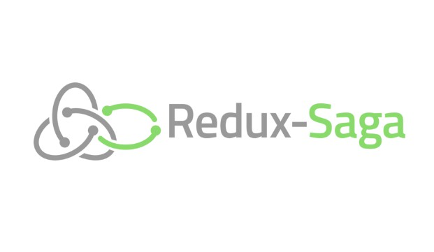

스터디 런닝
--

📝  끈기가 부족한 사람들을 위한 공부를 도와 주는 웹사이트

⛳  목표
--
REACT와 SSR을 이용한 프로젝트 만들기

🚀 사용한 스킬
--
#### FRONT

     
✔REACT.JS 
✔STYLED-COMPONENT  
✔REDUX  
✔REDUX_SAGA  
✔NEXT.JS  

#### BACK 
  
✔NODE.JS(EXPRESS) 
✔MYSQL 

📆 작업기간
--
총 작업기간 : 12/11 ~ 12/31
12/11 - 기획안 작성
12/12 - UI, UX프로토타입 설계

🛠 주요기능
--
✔<b>소셜로그인을 통한 간편 로그인!</b>
>로그인 및 회원가입, 소셜 로그인 연동

✔<b>공부습관에서 목표세우기는 매우 중요!</b>
>목표와 기간세우기

>투두 리스트 작성 제공

✔<b>기억은 기록을 이기지 못한다!</b>
>그날의 공부내용 정리할 수 있도록 제공 - 공부한내용 모아보기 기능(마치 블로그 처럼)

>글쓰기 에디터는 마인드맵, 일반 에디터, 마크다운 모두 제공

✔<b>원하는 나만의 스타일을 찾아서!</b>
>사용자가 원하는 색감테마 가능 - 원하는 색으로 넣을 수 있음

🎞 프로토타입
--